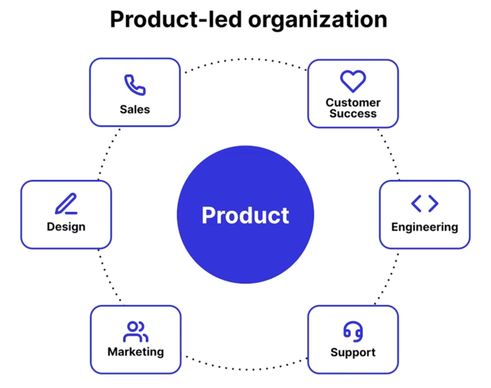

<!-- paginate: true -->
<!-- color: #1b3044 -->

# **Product led : Comprenons ce que c'est**
      

**Théo Moussaoui** 

---

# Pourquoi devenir Product Led ?
 
Les gens veulent une superbe expérience.
Peu d'entreprises offrent une expérience produit de haute qualité

Les produits ont un impact direct sur les effets business et notamment :
* l'adoption
* la productivité
* la conservation utilisateur
* l'engagement

---

# Construire une superbe expérience produit c'est :

## **Plus de valeur** pour les clients & des employés **plus satisfaits** 

---

# Les organisations P-Led :

* **Alignent chaque fonction autour du produit**
* **Prennent des décisions sur la data**
* **Utilisent le produit comme un canal marketing**
* **Ont un onboarding remarquable**
* **Permettent aux personnes de trouver leurs solutions eux-mêmes**
* **Collectent et utilisent les feedbacks**

---

# Le marketing Product-Led :
- Identifie les points d'activation clé qui mènent l'usage et la conversion et utilise ces éléments pour améliorer les messages et la stratégie au sein du produit
- Identifie les utilisateurs clés qui pourront aider le développement du produit

---

# Le customer success Product-led
- C'est les 👀, 👂🏼 et ❤️ d'une organisation product-led
- ils contribuent à entretenir la relation, et à mesurer différentes données pertinentes sur les ressentis utilisateurs et autres.

---

# Les bénéfices de devenir Product-led

- Une plus grande flexibilité !
- Une plus grande responsivité
- Une optimisation des revenus
- UNe expérience produit de meilleure qualité

---
Outil :
# Jobs to be Done

>### Quels sont les choses pour lesquelles mes utilisateurs choisissent mon produit ? 

---

# Exploiter la data pour construire de super produits :
 ## Les équipes produit doivent savoir ce que les utilisateurs **veulent**, **disent** et **font**
 Pour ça 
 * Identifier les questions à répondre.
 * Trouver les métriques qui peuvent y répondre 
 * Chaque département doit avoir ses indicateurs product-led pertinents 

---

# Les catégories d'indicateurs :
* Outcome business
* Usage du produit
* Qualité du produit

---

<!-- header: '**Métriques intéressantes**' -->

### **Net Revenue Retention (NRR)** 
Combien d'argent mon produit génère à partir des clients existants ? 

      Revenu mois dernier + revenu additionnel - désabonnements - ventes à perte 
      ----------------------------------------------------------------------------
                                  Revenu mois dernier 

---

<!-- header: '**Métriques intéressantes**' -->

### **Adoption**
Les utilisateurs adoptent-ils mon produit ou mes nouvelles fonctionnalités ? 

Adoption produit :

    Utilisateurs actifs journaliers, hebdomadaires, mensuels

Adoption Fonctionnalité :

    Mesurer les clicks/actions de certaines fonctionnalités

> Mesurer à la sortie mais également plus tard pour voir le maintien dans le temps

---

### **Adhésion**
Les utilisateurs reviennent-ils sur mon produit ? 

    Un taux sur :
    Utilisateurs mensuels qui reviennent chaque semaines
    Utilisateurs hebdomadaires qui reviennent chaque jour
    Utilisateurs mensuels qui reviennent chaque jour

---

### **Croissance**
Mon produit attire et conserve-t-il les utilisateurs plus vite qu'il n'en perd ?

    Nouveaux utilisateurs + utilisateurs récupérés
    ----------------------------------------------
                  Utilisateurs perdus

---

### **Score d'engagement produit (PES)**
Quel est l'engagement sur mon produit ? 

    Adoption + Adhésion + Croissance
    --------------------------------  X100
                  3

---

### **Retention**
Mes utilisateurs créent-ils des habitudes avec mon produit ?

  Rétention Produit

    Utilisation du produit sur une période donnée
  
  Rétention Fonctionnalité

    Quelles fonctionnalités font revenir mes utilisateurs ?

> Segmenter par type d'utilisateur pour une meilleure compréhension

---

### **Time to Value**
Combien de temps mes utilisateurs mettent-ils pour tirer de la valeur de mon produit ?

    Différence entre début du'tilisation et le *Aha moment*

> Aha moment : Le moment où un utilisateur comprend pourquoi il à besoin de telle élément. 

---

### **Net Promoter Score**
Mes utilisateurs sont-ils satisfaits mon produit ?

    #Promoteurs     #Détracteurs 
    -----------  -  ------------  x100
    #Répondants     #Répondants

> Détracteurs 1-6 
Passifs 7-8
Promoteurs 9-10

---

### **Top demandes de fonctionnalités**
Que veulent mes utilisateurs ?

    Requêtes les plus récurentes
    Requêtes des plus gros clients

---

### **Performance produit**
Mon produit fonctionne-t-il sans bugs ?

    Nombre de bugs
    Rapport Bug/usage
    autres...

---

# **Livrer des produits différemment**

Aujourd'hui, nous livrons beaucoup plus souvent, **il faut en profiter !**

## Attention !
### Fonctionnalité Livrée =/= Fonctionnalité apportant de la ** !valeur**

---

# **Communiquer sur les nouvelles fonctionnalités**

Donner de la documentation n'est pas suffisant, 

Il faut éduquer les utilisateurs !   

- **Pop ups**
- **Bouton info**
- **Publication réseaux sociaux**

>Être clair sur les utilisateurs **nécessitant** d'être notifiés et sur **l'action souhaitée**

---

# **Mesurer l'adoption**

Il ne suffit pas de voir si une fonctionnalité est utilisée. 

Ces éléments sont intéressants :

- **Ampleur d'adoption**
- **Temps avant l'adoption**
- **Durée de l'adoption**

---

# **Feedbacks !**

Les feedbacks valent de l'OR, il est judicieux :
- D'écouter les utilisateurs
- D'investir dans les moyens de récolter les feedbacks à grande échelle
- Clore la boucle avec les parties prenantes 

---

# **Règles de feedback**

### Comment soumettre un feedback, à quelle fréquence ils sont inspectés, et comment communiquer en retour aux utilisateurs

---

# **Product Operations (Product OPS)**

C'est à l'intersection du produit, de l'ingénierie et des customer success

